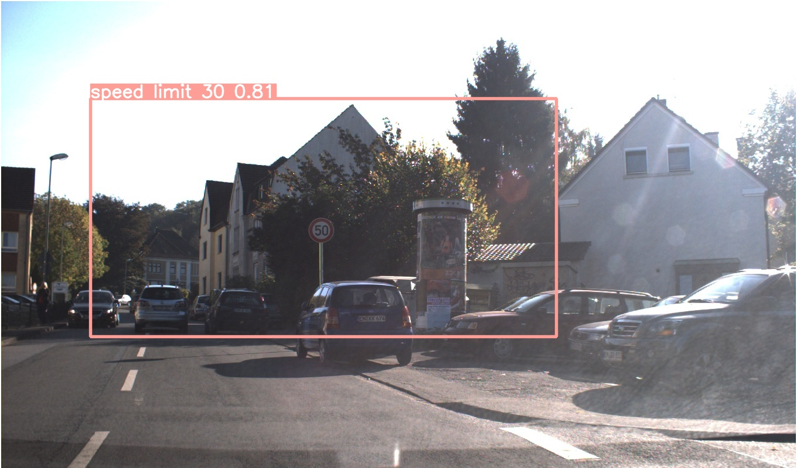

This project involves training multiple iterations of a model using various inputs to improve its performance. This README file provides detailed information about the features and characteristics of these refined models.

<iframe src="https://giphy.com/embed/ZVik7pBtu9dNS" width="480" height="268" frameBorder="0" class="giphy-embed" allowFullScreen></iframe>
<a href="https://giphy.com/gifs/life-interesting-footage-ZVik7pBtu9dNS">via GIPHY</a>

During the course of this project, modifications were primarily focused on two key aspects: the dataset used and the number of epochs. 

---

**NOTE**

The models were developed using the Colab Free GPU, necessitating adherence to computational limitations and constraints. As a result, careful consideration was given to striking a balance between computational power and achieving satisfactory outcomes.

---

**YOLOv8.ipynb**

The starting point for this project was the Detection *YOLOv8.ipynb* notebook, which served as the baseline model. Subsequently, enhancements and refinements were implemented to improve its performance and accuracy.

The model in this project was trained using the German Traffic Sign Detection Benchmark (GTSDB) dataset. The training process involved setting the image size to 600 pixels and training for a total of 30 epochs. The hyperparameters of the model were configured to utilize the default values provided by YOLO.

After evaluating the model, it was observed that the mAP50 (mean Average Precision at IoU threshold of 0.5) and mAP50-95 (mean Average Precision across IoU thresholds from 0.5 to 0.95) values were significantly low. 

---
***YOLO Default Hyperparameters***

https://docs.ultralytics.com/usage/cfg/#train

---

