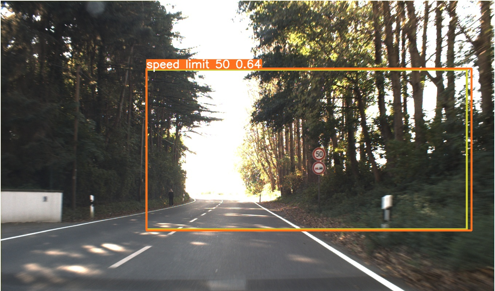
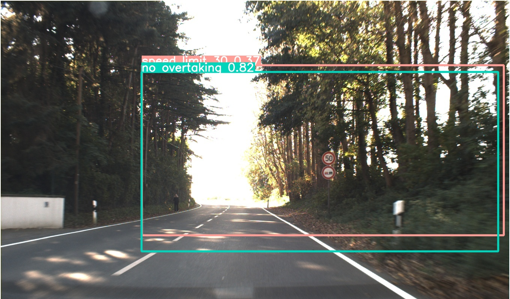
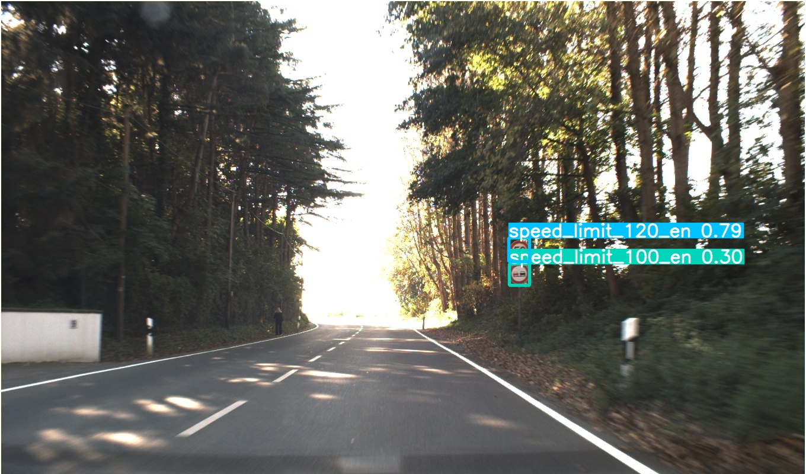
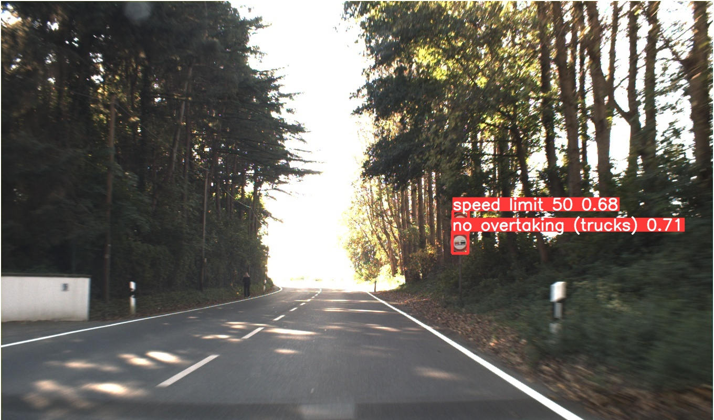
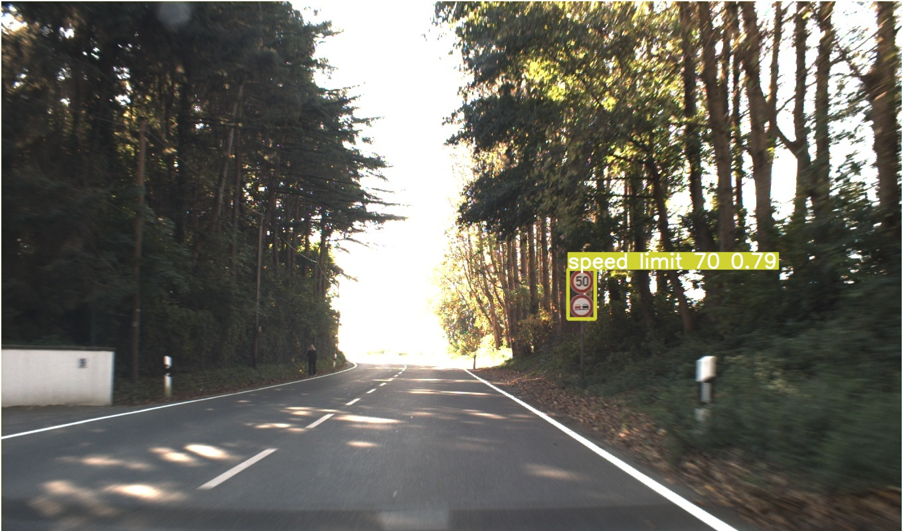

This project involves training multiple iterations of a model using various inputs to improve its performance. This README file provides detailed information about the features and characteristics of these refined models.

<<<<<<< HEAD

=======
<iframe src="https://giphy.com/embed/ZVik7pBtu9dNS" width="480" height="268" frameBorder="0" class="giphy-embed" allowFullScreen></iframe>
<a href="https://giphy.com/gifs/life-interesting-footage-ZVik7pBtu9dNS">via GIPHY</a>

>>>>>>> 69ef4531f9673a9ab1ff9880c5d7d1a5130cf556

During the course of this project, modifications were primarily focused on two key aspects: the dataset used and the number of epochs. 

---

**NOTE**

The models were developed using the Colab Free GPU, necessitating adherence to computational limitations and constraints. As a result, careful consideration was given to striking a balance between computational power and achieving satisfactory outcomes.

---

**Detection_YOLOv8.ipynb**

The starting point for this project was the Detection *YOLOv8.ipynb* notebook, which served as the baseline model. Subsequently, enhancements and refinements were implemented to improve its performance and accuracy.

The model in this project was trained using the German Traffic Sign Detection Benchmark (GTSDB) dataset. The training process involved setting the image size to 600 pixels and training for a total of 30 epochs. The hyperparameters of the model were configured to utilize the default values provided by YOLO.

After evaluating the model, it was observed that the mAP50 (mean Average Precision at IoU threshold of 0.5) and mAP50-95 (mean Average Precision across IoU thresholds from 0.5 to 0.95) values were significantly low. 

---

**Detection_YOLOv8_2.ipynb**

A notable modification to the Baseline model involved increasing the number of epochs from 30 to 50. Consequently, the updated model yielded improved results. The mAP50 score increased to 0.314, while the mAP50-95 score reached 0.236.Despite the adjustments made to the model, the achieved mAP score values remained inadequate.

---
**Detection_YOLOv8_3.ipynb**

Upon encountering unsuccessful results with the initial two models, a decision was made to switch to a different dataset. The original GTSDB dataset was replaced with the German traffic sign dataset available on the roboflow site. The revised model was then trained for 25 epochs using this new dataset. The decision to switch datasets was prompted by improved performance, as indicated by mAP50 and mAP50-95 scores of 0.82 and 0.74, respectively.

---
**Detection_YOLOv8_4.ipynb**

After achieving successful results with model-3 using the new dataset, a decision was made to retrain the model with an extended duration of 50 epochs, surpassing the previous 25 epochs. This adjustment led to significant improvements in performance, resulting in remarkably high mAP50 and mAP50-95 scores of 0.99 and 0.791, respectively.

---
**Detection_YOLOv8_5.ipynb**

Upon achieving success with Model_4, the development stages were concluded. However, in an attempt to understand the reasons behind the failures encountered with the original GTSDB dataset used in the baseline and Model_2, an analysis was conducted. Considering the possibility of insufficient data being a contributing factor, data augmentation techniques were applied, resulting in a quadrupling of the dataset. The model was then retrained using this augmented dataset for 30 epochs. The subsequent evaluation yielded promising results, with mAP50 and mAP50-95 values of 0.971 and 0.868, respectively. Despite this progress, further examination of the test data revealed that it still fell short in terms of sufficiency for successful traffic sign detection.

---
***YOLO Default Hyperparameters***

https://docs.ultralytics.com/usage/cfg/#train

---

***Original German Traffic Sign Detection Benchmark***

https://benchmark.ini.rub.de/gtsdb_news.html

---

***traffic-sign-detection-germany Image Dataset***

https://universe.roboflow.com/projectthesis/traffic-sign-detection-germany/dataset/6

---
