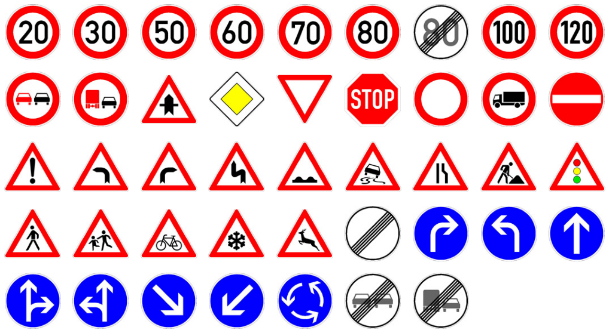

# Traffic Sign Detection Using YOLOv8

>Hacettepe University Artificial Intelligence Engineering AIN420 Course Project

## General Information 
=============================
This repository provides code and instructions for implementing traffic sign detection using the YOLO_v8 object detection algorithm, along with the German Traffic Sign Detection Benchmark (GTSDB) dataset. YOLO_v8 is a state-of-the-art object detection algorithm known for its high accuracy and real-time processing capabilities. The GTSDB dataset is a widely used benchmark for evaluating traffic sign detection algorithms, providing a diverse collection of annotated images captured from various traffic scenarios on German roads.

## Datasets
=============================

The German Traffic Sign Detection Benchmark (GTSDB) is a widely recognized dataset that plays a significant role in the evaluation and benchmarking of traffic sign detection algorithms, particularly for the German traffic system. The dataset consists of high-resolution images capturing various traffic scenarios on German roads, encompassing a diverse collection of traffic sign images with different shapes, sizes, colors, and environmental conditions. It covers a wide range of traffic sign classes commonly found on German roads, including speed limit signs, stop signs, yield signs, and more. Each image in the GTSDB dataset is meticulously annotated with bounding boxes indicating the precise locations of traffic signs, along with corresponding class labels. This comprehensive dataset serves as a crucial resource for training and validating traffic sign detection models, enabling researchers to develop more accurate and robust algorithms. Moreover, GTSDB has become a standard benchmark for assessing the accuracy, robustness, and efficiency of traffic sign detection algorithms, allowing for the comparison and evaluation of different approaches. By leveraging the GTSDB dataset, advancements in traffic sign detection research have contributed to significant improvements in real-world applications, including autonomous vehicles, advanced driver assistance systems (ADAS), and traffic management systems, ultimately enhancing road safety and efficiency.

GTSDB Database Link http://benchmark.ini.rub.de/?section=gtsdb&subsection=dataset

